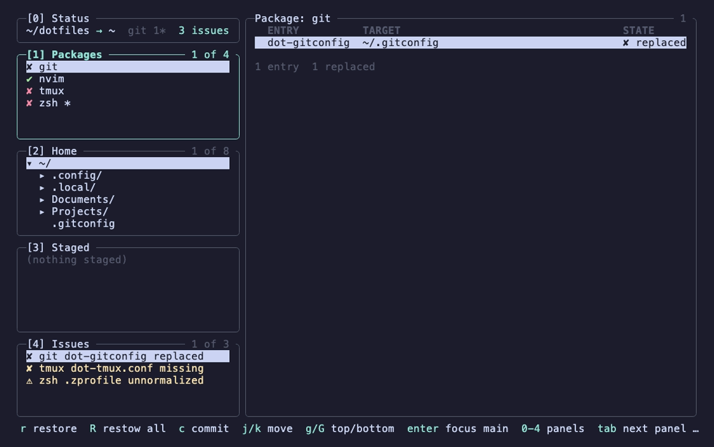
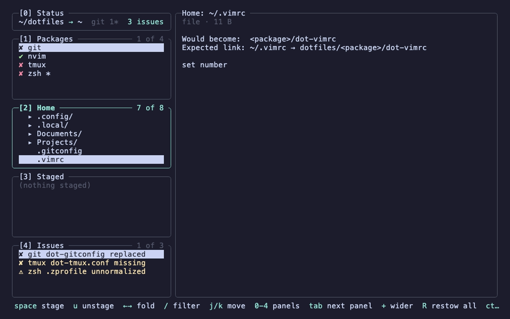
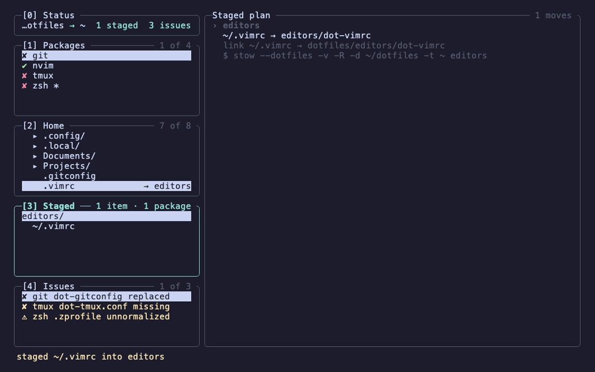
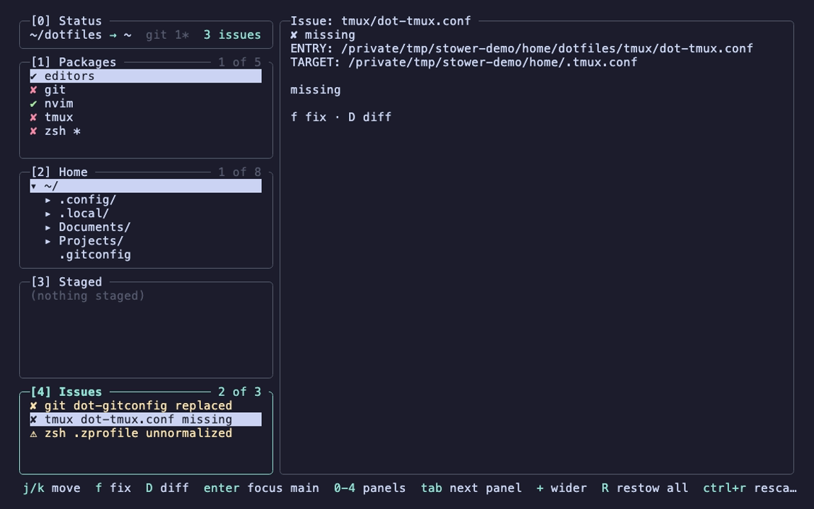

# stower

A terminal UI for managing a dotfiles repository with [GNU Stow](https://www.gnu.org/software/stow/).

stower browses your home directory, stages files and directories into stow packages, moves
them into the repository and links them back with `stow --dotfiles`, restores them, checks
link health and commits to git. It never creates or removes symlinks itself: every link
operation is delegated to the `stow` binary.


## Requirements

- macOS or Linux.
- GNU Stow 2.4 or newer on `PATH` (`stow --dotfiles` support is required).
- git on `PATH` for the commit features. Without git stower still works, only the commit
  popup and the dirty markers are unavailable.
- Go 1.27 or newer, only when building from source.

```sh
brew install stow git          # macOS
sudo apt install stow git      # Debian, Ubuntu
sudo pacman -S stow git        # Arch
```

Check the stow version before the first run:

```sh
stow --version
```

## Installation

### With Homebrew

```sh
brew install horbo/tap/stower
```

Later upgrades:

```sh
brew upgrade stower
```

The formula pulls in GNU Stow as a dependency. git is not a dependency: install it yourself
if you want the commit features.

### With `go install`

```sh
go install github.com/horbo/stower/cmd/stower@latest
```

The binary lands in `$(go env GOPATH)/bin`, usually `~/go/bin`. Make sure that directory is
on your `PATH`.

### From source

```sh
git clone https://github.com/horbo/stower.git
cd stower
make build
```

`make build` writes a static `stower` binary into the repository root with the version taken
from `git describe`. Copy it anywhere on your `PATH`, for example:

```sh
install -m 755 stower /usr/local/bin/stower
```

`make check` runs gofmt, `go vet`, the build and the tests.

### Verify

```sh
stower --version
```

## First run

By default stower manages `~/dotfiles` and links into `$HOME`. Both can be changed:

| Option                | Environment variable | Default       |
|-----------------------|----------------------|---------------|
| `--dotfiles <dir>`    | `STOWER_DOTFILES`    | `~/dotfiles`  |
| `--target <dir>`      |                      | `$HOME`       |
| `--no-mouse`          | `STOWER_NO_MOUSE=1`  | mouse enabled |

If the dotfiles directory does not exist, stower offers to create it and to initialise a git
repository in it. An existing directory without git gets a `git init` offer.

The repository layout follows `stow --dotfiles`: one directory per package, and a leading
`dot-` in a file or directory name becomes a leading `.` in the target. For example
`~/dotfiles/zsh/dot-zshrc` is linked as `~/.zshrc` and
`~/dotfiles/nvim/dot-config/nvim/` as `~/.config/nvim/`.

To try stower without touching your real home directory, point it at a throwaway target:

```sh
FAKE=$(mktemp -d)
mkdir -p "$FAKE/.config/foo" && echo x > "$FAKE/.bar"
stower --target "$FAKE" --dotfiles "$FAKE/dotfiles"
```

## Screenshots

|  |  |
| :-- | :-- |
| **Overview** — packages, the home tree, the staged plan and link issues in one layout.<br> | **Staging** — highlight anything under `$HOME` and see the package path and link it would get.<br> |
| **Staged plan** — every `mv` and every `stow` invocation, shown before a single file moves.<br> | **Issues** — link health per entry, with a one-key fix for the repairable ones.<br> |

## Command line

```
stower [--dotfiles <dir>] [--target <dir>] [--no-mouse]   start the TUI
stower status [--dotfiles <dir>] [--target <dir>]         print link health and exit
stower restow [--dotfiles <dir>] [--target <dir>]         run stow -R on every package
stower --version                                          print the version
```

`stower status` prints one line per package entry with its state: `ok`, `missing`, `replaced`,
`foreign`, `unowned` (the link resolves to the right entry but stow will not recognise it as
its own) or `unnormalized`. It exits non-zero when any link is not healthy, which makes it
usable from scripts and shell prompts.

## Keys

Press `?` inside stower for the full key list. The most important ones:

| Key         | Action                                              |
|-------------|-----------------------------------------------------|
| `0`–`4`     | focus Status, Packages, Home, Staged, Issues        |
| `tab`       | next panel                                          |
| `enter`     | focus the main panel; in Staged: apply the plan     |
| `space`     | Home: stage the highlighted entry into a package    |
| `u`         | Home, Staged: unstage                               |
| `r`         | restore a package, or marked entries, to the target |
| `f`         | fix the highlighted issue                           |
| `R`         | restow every package                                |
| `c`         | commit the repository                               |
| `ctrl+r`    | rescan                                              |
| `q`         | quit                                                |

Mouse clicks and the wheel work in every panel and popup. Start with `--no-mouse` to keep
the terminal's own text selection.

## Development

```sh
make check
go test -race ./internal/...
```

The GIF and the screenshots are recorded with [VHS](https://github.com/charmbracelet/vhs):

```sh
make demo
```

`docs/assets/fixture.sh` builds the throwaway home under `/tmp/stower-demo` that the
recording drives, and `docs/assets/demo.tape` is the script. Neither touches the real
`$HOME`.

The design and the domain rules live in `docs/DESIGN.md`; milestones and their status in
`docs/milestones/`; the release procedure in `docs/RELEASING.md`.

## License

MIT, see `LICENSE`.
